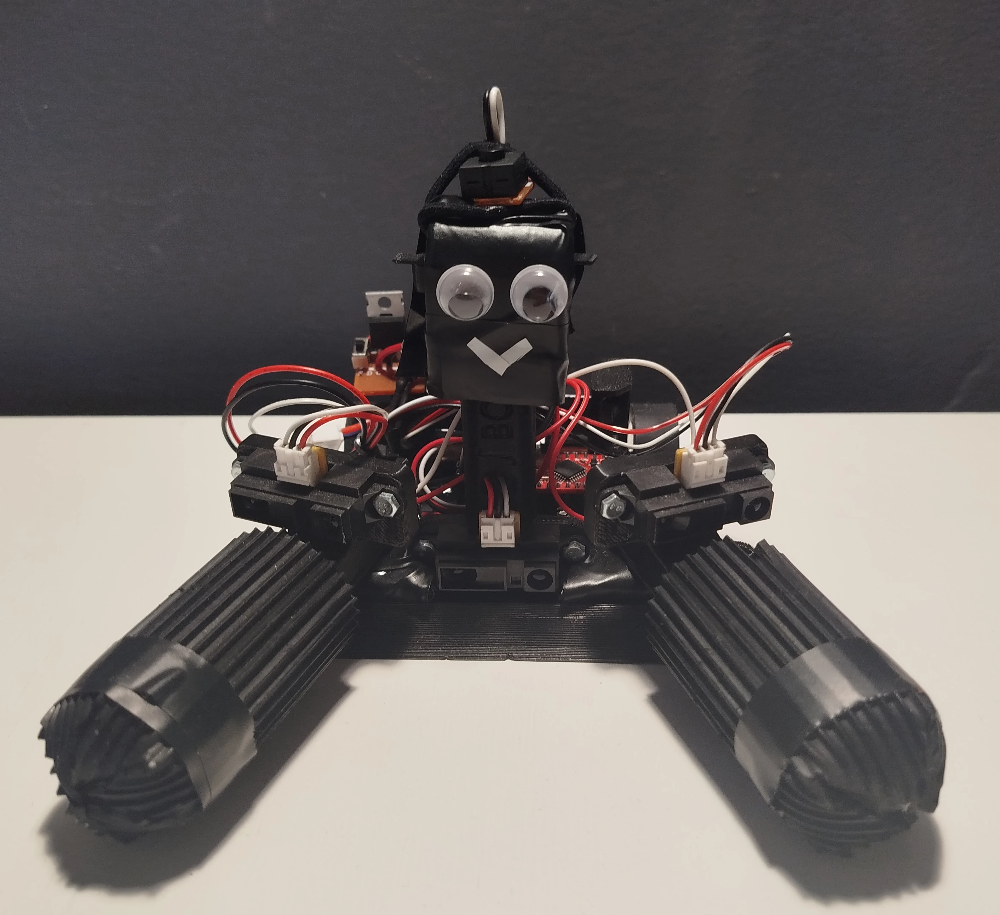

# CalkaBot3K0

    

Całkabot 3k0 is a mini-sumo robot equipped with arms designed to lift the opponent. Taking advantage of the lack of size restrictions after the round begins, this beauty you see in the picture unfolds its lifting arms. In the photo, it's already in the fully deployed position.

More info [here](https://jakubkivi.github.io#portfolio-modal-calk3)
